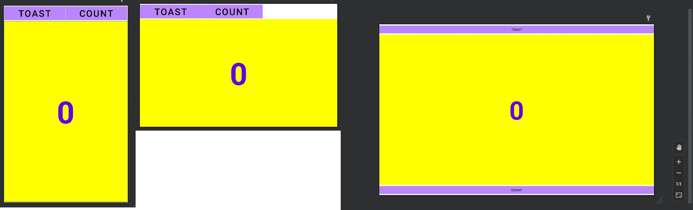
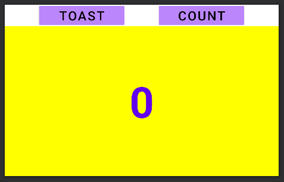
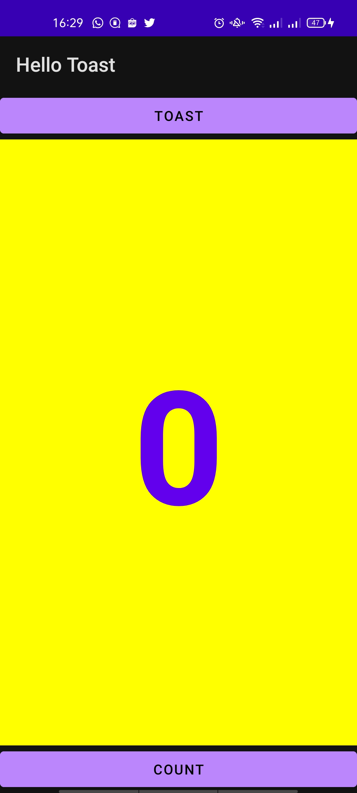
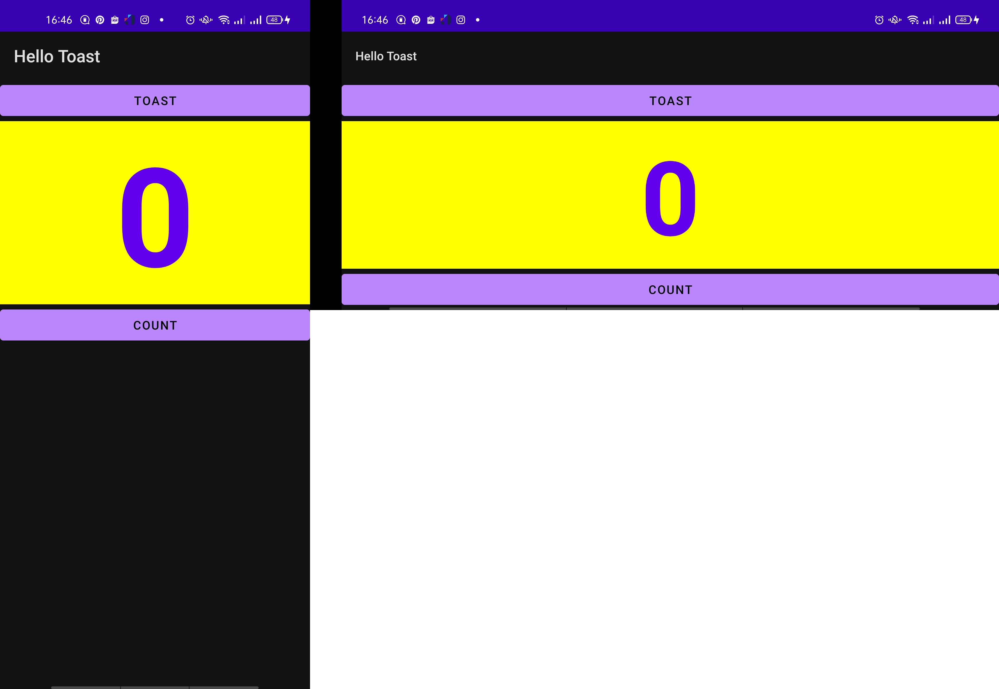
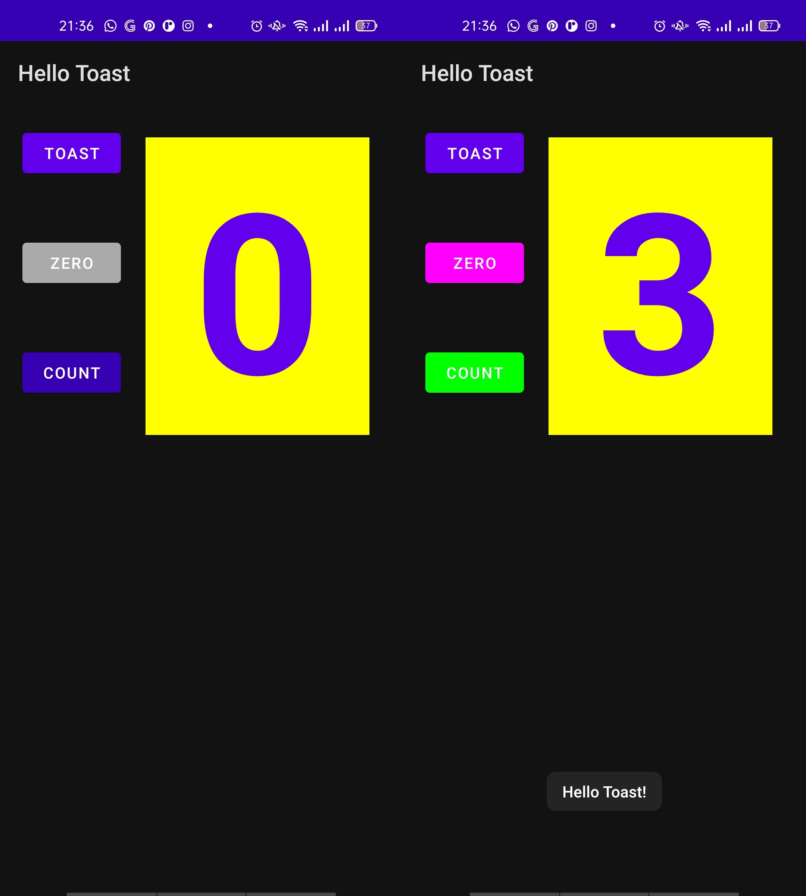
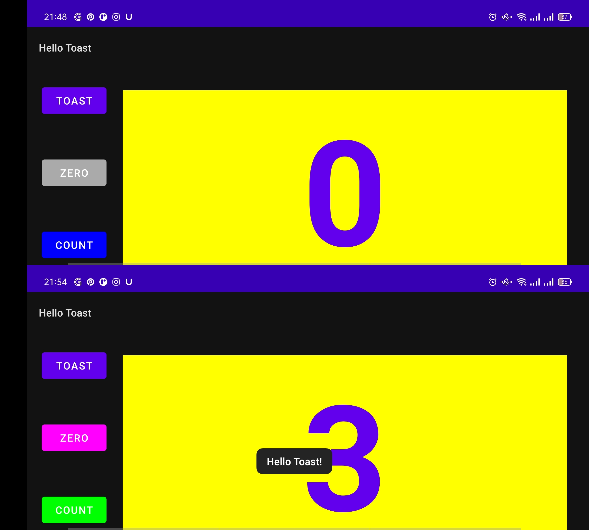

# Android fundamentals 01.2 Part B: The layout editor

Praktikum  Minggu - 3  

    Nama  : Adika Ahmad Hanif Nazhir  
    Kelas : TI 3B  
    NIM   : 2041720171  

## Hasil Praktikum

### Task 1 : Layout Variants ( Portrait & Landscape)

### Coding Challenge 1

### Task 2 : Change Layout to LinearLayout

### Task 3 : Change LinearLayout to RelativeLayout

### Homework Portrait

### Homework Landscape

